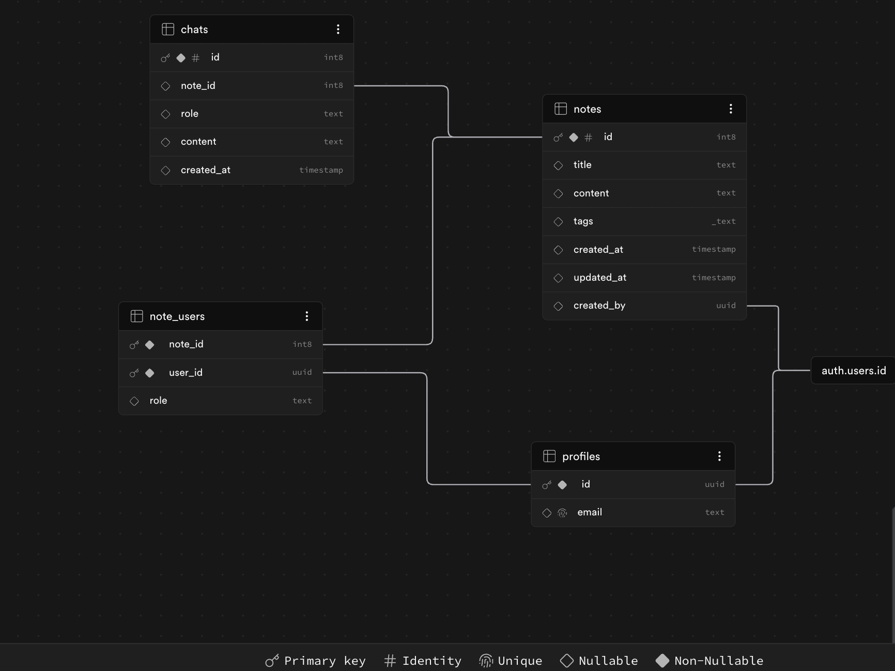

# Database

## SUPABASE

## Schema

## TABLES

-- WARNING: This schema is for context only and is not meant to be run.
-- Table order and constraints may not be valid for execution.

### Notes

CREATE TABLE public.notes (
id bigint GENERATED ALWAYS AS IDENTITY NOT NULL,
title text,
content text,
tags ARRAY,
created_at timestamp without time zone DEFAULT now(),
updated_at timestamp without time zone DEFAULT now(),
created_by uuid,
CONSTRAINT notes_pkey PRIMARY KEY (id),
CONSTRAINT notes_created_by_fkey FOREIGN KEY (created_by) REFERENCES auth.users(id)
);

### Chats

CREATE TABLE public.chats (
id bigint GENERATED ALWAYS AS IDENTITY NOT NULL,
note_id bigint,
role text,
content text,
created_at timestamp without time zone DEFAULT now(),
CONSTRAINT chats_pkey PRIMARY KEY (id),
CONSTRAINT chats_note_id_fkey FOREIGN KEY (note_id) REFERENCES public.notes(id)
);

### Note_Users

CREATE TABLE public.note_users (
note_id bigint NOT NULL,
user_id uuid NOT NULL,
role text DEFAULT 'viewer'::text,
CONSTRAINT note_users_pkey PRIMARY KEY (note_id, user_id),
CONSTRAINT note_users_note_id_fkey FOREIGN KEY (note_id) REFERENCES public.notes(id),
CONSTRAINT note_users_user_id_fkey FOREIGN KEY (user_id) REFERENCES public.profiles(id)
);

### Profile

CREATE TABLE public.profiles (
id uuid NOT NULL,
email text UNIQUE,
CONSTRAINT profiles_pkey PRIMARY KEY (id),
CONSTRAINT profiles_id_fkey FOREIGN KEY (id) REFERENCES auth.users(id)
);

## Stored Procedures (SPC)

| routine_name         | routine_type | data_type |
| -------------------- | ------------ | --------- |
| get_note_members     | FUNCTION     | record    |
| handle_new_user      | FUNCTION     | trigger   |
| share_note_by_email  | FUNCTION     | void      |
| share_note_by_emails | FUNCTION     | void      |

### get_note_members

CREATE OR REPLACE FUNCTION public.get_note_members(note_id bigint)
RETURNS TABLE(note_id bigint, user_id uuid, role text, email text)
LANGUAGE sql
SECURITY DEFINER
AS $function$
select
nu.note_id,
nu.user_id,
nu.role,
p.email
from note_users nu
join profiles p on p.id = nu.user_id
where nu.note_id = note_id;
$function$

### handle_new_user

CREATE OR REPLACE FUNCTION public.handle_new_user()
RETURNS trigger
LANGUAGE plpgsql
SECURITY DEFINER
AS $function$
begin
insert into profiles (id, email)
values (new.id, new.email);
return new;
end;
$function$

### share_note_by_email

CREATE OR REPLACE FUNCTION public.share_note_by_email(p_note_id bigint, p_email text)
RETURNS void
LANGUAGE plpgsql
SECURITY DEFINER
AS $function$
declare
target_user uuid;
begin
select id into target_user
from profiles
where email = p_email;

if target_user is null then
raise exception 'User not found';
end if;

insert into note_users (note_id, user_id, role)
values (p_note_id, target_user, 'viewer');
end;
$function$

### share_note_by_emails

CREATE OR REPLACE FUNCTION public.share_note_by_emails(p_note_id bigint, p_emails text[])
RETURNS void
LANGUAGE plpgsql
SECURITY DEFINER
AS $function$
declare
e text;
target_user uuid;
begin
foreach e in array p_emails
loop
select id into target_user
from profiles
where email = e;

    if target_user is not null then
      insert into note_users (note_id, user_id, role)
      values (p_note_id, target_user, 'viewer')
      on conflict do nothing;
    end if;

end loop;
end;
$function$

## Row Level Security

### notes

- Users can delete own notes
- cmd - DELETE
- qual - (auth.uid() = created_by)
- with_check

- Users can update own notes
- cmd - UPDATE
- qual - (auth.uid() = created_by)
- with_check

- Users can insert own notes
- cmd - INSERT
- qual
- with_check - (auth.uid() = created_by)

- Users can view shared notes
- cmd - SELECT
- qual - ((auth.uid() = created_by) OR (EXISTS ( SELECT 1
  FROM note_users nu
  WHERE ((nu.note_id = notes.id) AND (nu.user_id = auth.uid())))))
- with_check

### note_users

- Users can view their note memberships
- cmd - SELECT
- qual - (user_id = auth.uid())
- with_check

- Only owners can share
- cmd - INSERT
- qual
- with_check -
  (EXISTS ( SELECT 1
  FROM notes
  WHERE ((notes.id = note_users.note_id) AND (notes.created_by = auth.uid()))))

- Owners can share notes
- cmd - INSERT
- qual
- with_check -
  (EXISTS ( SELECT 1
  FROM notes
  WHERE ((notes.id = note_users.note_id) AND (notes.created_by = auth.uid()))))

### profiles

- No RLS

### chats

CREATE POLICY "Owner can view chat"
ON chats
FOR SELECT
USING (
EXISTS (
SELECT 1
FROM notes n
WHERE n.id = chats.note_id
AND n.created_by = auth.uid()
)
);

CREATE POLICY "Owner can insert chat"
ON chats
FOR INSERT
WITH CHECK (
EXISTS (
SELECT 1
FROM notes n
WHERE n.id = chats.note_id
AND n.created_by = auth.uid()
)
);

CREATE POLICY "Owner can update chat"
ON chats
FOR UPDATE
USING (
EXISTS (
SELECT 1
FROM notes n
WHERE n.id = chats.note_id
AND n.created_by = auth.uid()
)
);

CREATE POLICY "Owner can delete chat"
ON chats
FOR DELETE
USING (
EXISTS (
SELECT 1
FROM notes n
WHERE n.id = chats.note_id
AND n.created_by = auth.uid()
)
);
